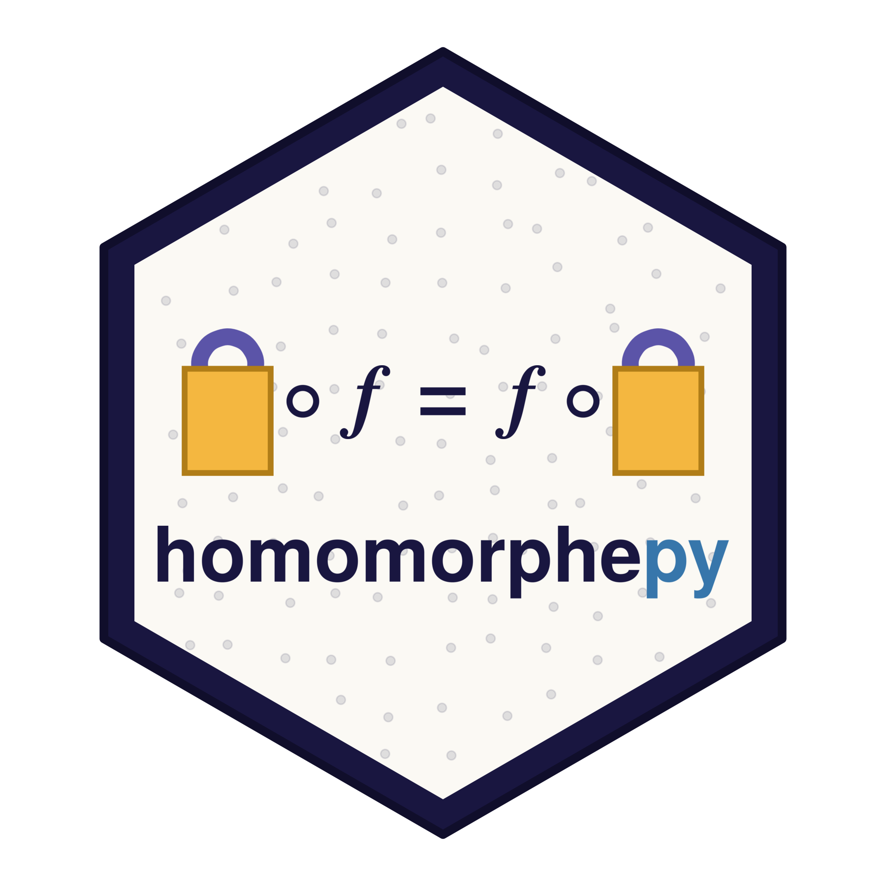

```{python}
#| include: false
import os

os.environ.setdefault("OMP_NUM_THREADS", "2")
import homomorphepy
```

{.float-end width="180" fig-alt="homomorphepy hex logo"}

`homomorphepy` computes statistics across several parties without any
of them revealing their data, using homomorphic encryption via
[OpenFHE](https://openfhe.org).

Version `{python} homomorphepy.__version__`, wrapping OpenFHE 1.5.1.

## The idea

Several sites hold data they will not share. They are willing to
compute a *joint* result, provided no party — including whoever
coordinates the computation — learns anything about an individual
site's contribution.

Each site computes a summary of its own data, encrypts it, and sends
the encrypted value. The aggregator adds those encrypted values
*without decrypting them* and recovers only the total. Under threshold keys the
guarantee is stronger still: the decryption key is split across the
sites, so no single party can decrypt anything at all.

What makes this practical for statistics is that the analysis code
does not change. An optimizer handed an objective that happens to
route through encryption converges to the same estimate it would have
reached on pooled data.

## Terms you will meet

<!-- lint-vocabulary: off -->
<!-- Naming each cryptographic term once is the point of this
     section; the rest of the documentation avoids them. -->

Encryption brings its own vocabulary, and a few of those words show up
in function names. None of them need a cryptography background. Where
a word has a standard cryptographic name you would meet elsewhere, it
appears in parentheses once and is then set aside.

- **Encrypted value** (*ciphertext*). What you get after encrypting a
  number or a vector of numbers. These can be added and multiplied
  without being decrypted first; `Ct` wraps one so that `+` and `*`
  work on it directly.
- **Cleartext value** (*plaintext*). The ordinary, unencrypted number
  — what you started with and what decryption returns. The same word
  also names the *encoded* intermediate the codec produces just before
  encryption, which is why `packed_codec` talks about encoding.
- **Slot.** An encrypted value is a vector with a fixed number of
  positions, usually thousands. One arithmetic operation acts on every
  slot at once, which is what makes encrypted vector arithmetic
  affordable. You typically use the first few and ignore the rest.
- **Site.** A party holding data that will not leave it. Sites never
  share data and never see each other's contributions.
- **Aggregator.** The party that collects encrypted per-site
  contributions, adds them while they stay encrypted, and obtains the
  total. In the API this object is called a `Master`.
- **Public and secret key.** The usual pair: encrypt with the public
  key, decrypt with the secret one. *Who holds the secret key* is the
  central design question in these protocols.
- **Evaluation keys.** Extra keys that *authorize* particular
  operations — multiplying two encrypted values, summing across slots,
  rotating a vector. They permit computation, not decryption.
- **Threshold keys.** An arrangement where no single party holds the
  secret key: each holds a share, and decryption needs all of them. No
  subset can decrypt anything.
- **Precision budget** (*multiplicative depth*). Real-valued encrypted
  arithmetic is approximate, and every multiplication spends part of a
  budget fixed when the parameters are chosen. Additions are
  essentially free. [Precision](precision.qmd) covers what this means
  in practice.
- **Scheme.** The encryption construction in use. **CKKS** handles
  real numbers approximately and is what most examples use, since
  statistical quantities are real-valued. **BFV** handles integers
  exactly, for counts where no approximation is acceptable.

That is the whole vocabulary. The examples that follow use only these
terms.

<!-- lint-vocabulary: on -->

## The shortest complete example

Three sites, each holding a private count, and a aggregator that
learns only the total:

```{python}
from homomorphepy import fhe_context, packed_codec, Ct

cc = fhe_context("BFV", plaintext_modulus=65537, multiplicative_depth=1)
keys = cc.KeyGen()
codec = packed_codec(cc)

private_counts = [46, 15, 52]          # each known only to its own site

cts = [Ct(cc.Encrypt(keys.publicKey, codec.encode(n)), cc.cc)
       for n in private_counts]

total = codec.decode(cc.Decrypt(sum(cts).raw, keys.secretKey), 1)[0]
total
```

The aggregator added encrypted values it could not read, and decrypted
only the sum. BFV is exact integer arithmetic, so the answer is the integer
and not an approximation of it. Everything else here is this idea with
more statistics on top.

## Examples

Grouped by what you are trying to do. Within each group, the simpler
example comes first.

**Queries and aggregation.** Counting across sites without revealing
who contributed what. The simplest complete protocols here, and the
best place to begin.

| Example | What it shows |
|---|---|
| [Aggregation](aggregation.qmd) | Encrypted counting. The simplest composition, and exact under BFV. |
| [Query counting](query-count.qmd) | The same count under threshold keys, where nobody can decrypt alone. |

**Fitting models across sites.** Each of these drives an ordinary,
unmodified fitting routine.

| Example | What it shows |
|---|---|
| [Maximum likelihood](mle.qmd) | An unmodified optimizer driving an encrypted objective. |
| [Cox regression](cox.qmd) | Survival analysis across three hospitals, single-decrypter and threshold. |
| [Consensus ADMM](consensus-admm.qmd) | Convex optimization where only the consensus step is encrypted. |
| [Cox-lasso](cox-lasso.qmd) | The full pipeline on gene expression: encrypted standardization, screening, and fitting. |

**Prediction.** Two parties, one holding a model and one holding data,
neither willing to reveal theirs.

| Example | What it shows |
|---|---|
| [Secure inference](secure-inference.qmd) | A lab scoring patients it cannot see — and the attack this does *not* prevent. |
| [Encrypted logistic prediction](encrypted-regression.qmd) | The same, with a sigmoid — a non-polynomial function evaluated without decrypting. |
| [Federated similarity search](similarity.qmd) | Retrieval across sites whose models disagree, under threshold keys and joint rotation keys. |

**Adding differential privacy.**

| Example | What it shows |
|---|---|
| [Differential privacy](dp.qmd) | What it costs to add DP on top — a demonstration, not a recommendation. |

[Precision](precision.qmd) explains what "the encrypted answer matches"
means for each scheme, and when to expect exactness rather than a
tolerance.

## Installing

The statistical layer installs normally. The crypto backend does not:

```bash
pip install homomorphepy          # examples, fixtures, DP accounting
```

`openfhe` is an **optional** dependency because its published wheels
are tagged `py3-none-any` while containing Linux/CPython-3.12
binaries — `pip install` reports success on macOS and the import then
fails. See the README for the working paths.

```{python}
#| echo: false
from IPython.display import Markdown
have = homomorphepy.have_backend()
Markdown(
    f"**This page was rendered with the crypto backend "
    f"{'available' if have else 'absent'}.** "
    + ("Every number below was computed through real encryption."
       if have else
       "Pages needing encryption will show their shipped results instead.")
)
```
